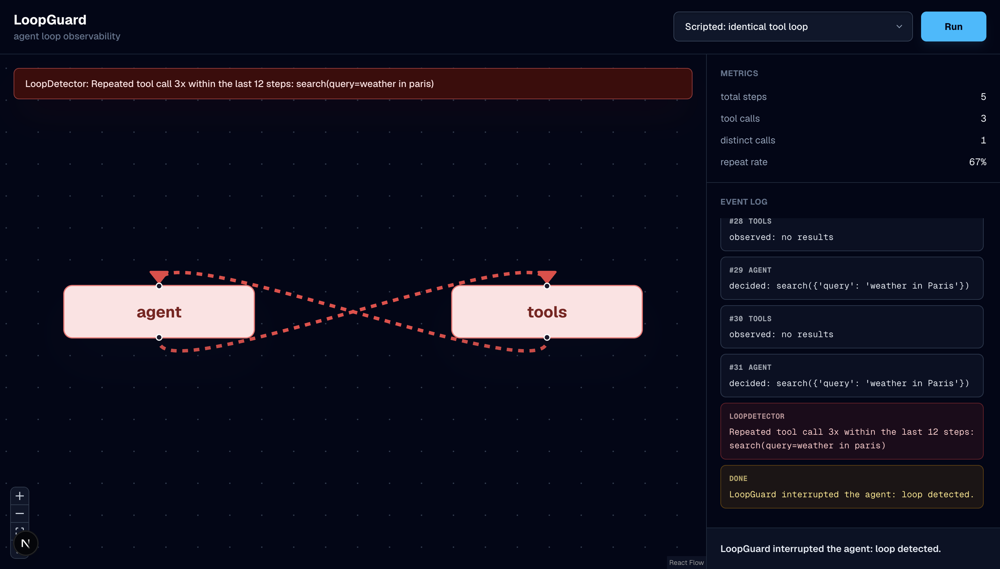
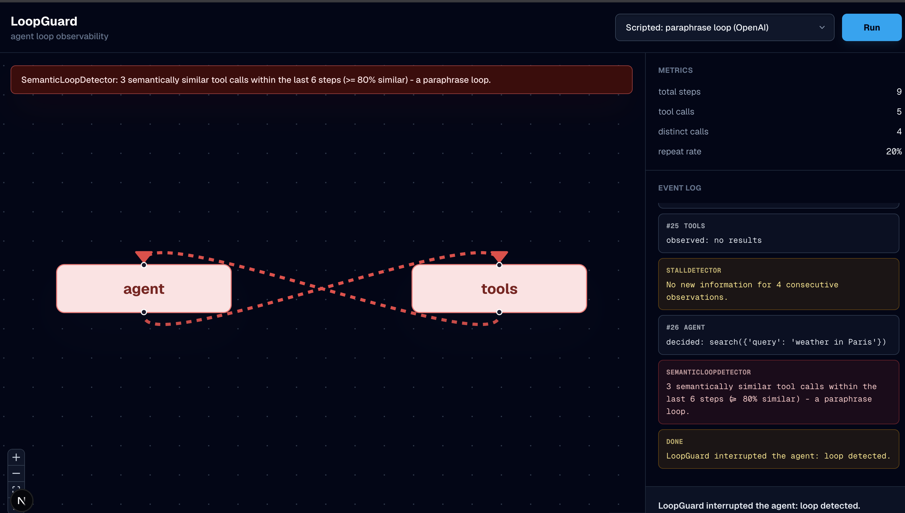
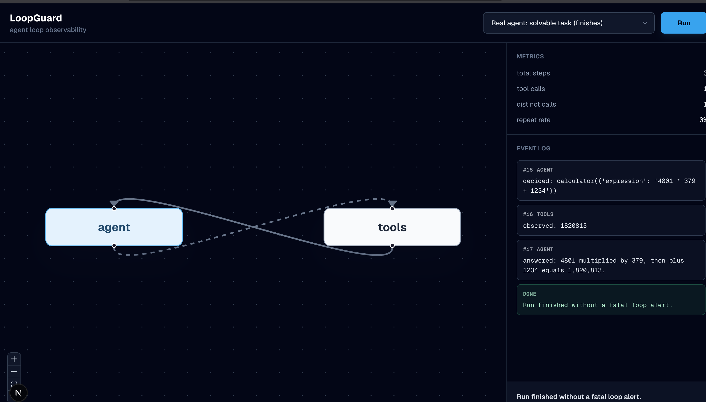
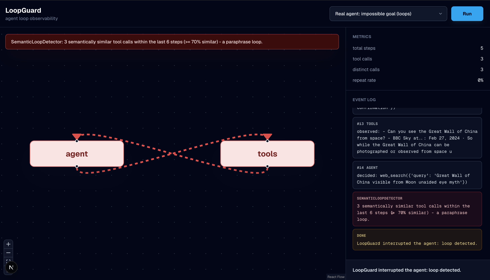

# LoopGuard

Progress-aware runtime guardrails for LangGraph and LangChain agents.

LoopGuard watches agent runs and decides whether the agent should continue, warn, replan,
pause, or stop. It does not stop an agent just because a tool repeats. It combines
repeated or cyclic actions with stagnant results, repeated failures, and lack of progress
to detect when the agent is actually stuck.

```text
same tool repeated + changing results       -> warn/continue
same tool repeated + same empty result      -> stop
search -> summarize -> search + no progress -> stop
temporary failure then success              -> continue
repeated permanent failure                  -> stop
```

## Install

LoopGuard is published on PyPI as `loopguard-runtime`:

```bash
pip install loopguard-runtime
```

Or pin the current release:

```bash
pip install loopguard-runtime==0.2.0
```

The package name is `loopguard-runtime`, but the Python import is `loopguard`:

```python
from loopguard import LoopGuardCallbackHandler
```

For LangGraph/LangChain callback dependencies:

```bash
pip install "loopguard-runtime[langgraph]"
```

For the full demo stack from GitHub source:

```bash
pip install "loopguard-runtime[demo,server] @ git+https://github.com/mahimathacker/loopguard.git"
```

## Quickstart

Attach LoopGuard to a LangGraph/LangChain run with the callback handler:

```python
from loopguard import LoopGuardCallbackHandler, LoopGuardInterrupt

handler = LoopGuardCallbackHandler()

try:
    result = agent.invoke(my_input, config={"callbacks": [handler]})
except LoopGuardInterrupt as exc:
    print("LoopGuard stopped the run:", exc)

print(handler.report())
```

The report includes:

- `events`: normalized tool calls and observations
- `signals`: detector evidence such as repeated calls or no progress
- `decisions`: policy actions such as continue, warn, replan, pause, or stop
- `metrics`: step counts, tool calls, repeat rate, and common actions
- `alerts`: legacy compatibility alerts

To observe without stopping the run:

```python
from loopguard import LoopGuardCallbackHandler

handler = LoopGuardCallbackHandler(interrupt_on_fatal=False)
result = agent.invoke(my_input, config={"callbacks": [handler]})

for decision in handler.report()["decisions"]:
    print(decision["action"], decision["risk_score"])
```

## Why LoopGuard

LLM agents run in a loop: think, act, observe, repeat. Sometimes that loop goes wrong and
the agent keeps spending steps without getting closer to the answer. Normal tracing can
show what happened, but it often leaves the developer to decide whether the run is still
useful.

LoopGuard stays narrow: it turns the trace into stuck-risk decisions. It complements broad
observability platforms rather than replacing them.

## How It Works

```text
Agent event -> Tracer -> Detectors -> DetectionSignals -> PolicyEngine -> GuardDecision
```

| Part | Job | File |
|------|-----|------|
| Tracer | Records each agent event. | `loopguard/tracer.py` |
| Metrics | Counts steps, tool calls, repeats, and common actions. | `loopguard/metrics.py` |
| Detectors | Turn events into scored evidence signals. | `loopguard/detectors.py`, `loopguard/signals.py` |
| Policy | Combines signals into continue/warn/replan/pause/stop decisions. | `loopguard/policy.py`, `loopguard/monitor.py` |

Current detectors/signals:

- `LoopDetector`: repeated normalized tool calls
- `SemanticLoopDetector`: repeated intent in different words, using embeddings
- `StallDetector` and `ProgressDetector`: stagnant observations and no progress
- `RepeatedFailureDetector`: retryable vs likely permanent failures
- `CycleDetector`: repeating action sequences
- `HandoffLoopDetector`: closed multi-agent handoff cycles
- Step/tool-call budget detectors

Detectors do not make the final execution decision alone. Repetition can warn; repetition
plus stagnant output can stop.

## Check Saved Traces

LoopGuard can analyze exported JSON traces without running the original agent:

```bash
python -m loopguard.ingest examples/sample_trace.json
python -m loopguard.ingest examples/sample_trace.json --json
loopguard-ingest examples/sample_trace.json --json
```

Use check mode for local scripts or CI-style pass/fail behavior:

```bash
python -m loopguard.check examples/sample_trace.json
python -m loopguard.check examples/sample_trace.json --fail-on stalled
python -m loopguard.check examples/sample_trace.json --max-steps 20 --max-tool-calls 10
python -m loopguard.check examples/sample_trace.json --config loopguard.yml
python -m loopguard.check examples/sample_trace.json --fail-on looping --fail-on stalled --json
loopguard-check examples/sample_trace.json --json
```

By default, only `looping` fails the check. Use `--fail-on stalled` to fail on no-progress
warnings too, or `--fail-on alerts` to fail on any alert. Step and tool-call budgets
always fail the check when exceeded.

The trace adapter is forgiving about field names such as `tool`, `tool_name`, `name`,
`args`, `arguments`, `input`, `output`, `result`, `agent`, and `caller`.

## Configuration

Keep local/live policy in a small `loopguard.yml`:

```yaml
live:
  max_steps: 40
  max_tool_calls: 15
  exact_threshold: 3
  exact_window: 12
  stall_patience: 4
  stall_fatal: false
  handoff_repeats: 2
  handoff_window: 16
  handoff_max_cycle_length: 5
  handoff_fatal: true
  semantic: false

check:
  fail_on:
    - looping
    - stalled
  max_steps: 40
  max_tool_calls: 15
```

For check-only config, top-level keys also work:

```yaml
fail_on:
  - looping
  - stalled
max_steps: 40
max_tool_calls: 15
```

Use config with the callback handler:

```python
from loopguard import LoopGuardCallbackHandler

handler = LoopGuardCallbackHandler.from_config("loopguard.yml")
agent.invoke(my_input, config={"callbacks": [handler]})
```

Set `semantic: true` to enable paraphrase-loop detection with embeddings. That path uses
OpenAI embeddings and requires `OPENAI_API_KEY`.

## Local Demos

The repo includes a FastAPI/WebSocket backend, a Next.js + React Flow UI, and four demo
scenarios:

- `exact`: scripted identical tool loop, offline
- `semantic`: scripted paraphrase loop, requires embeddings
- `calc`: real `gpt-4o-mini` agent that finishes
- `trap`: real `gpt-4o-mini` agent given an impossible goal

Screenshots:






Run the local demo stack:

```bash
git clone https://github.com/mahimathacker/loopguard.git
cd loopguard
python3.11 -m venv .venv
source .venv/bin/activate
pip install -r requirements.txt
cp .env.example .env
```

Set `OPENAI_API_KEY` in `.env` for semantic and real-agent scenarios.

Terminal 1:

```bash
uvicorn server:app --reload --port 8000
```

Terminal 2:

```bash
cd ui
npm install
npm run dev
```

Open http://localhost:3000.

Command-line demos:

```bash
python main.py            # exact, offline
python main.py semantic   # semantic loop
python main.py calc       # real agent, finishes
python main.py trap       # real agent, loops and gets caught
```

## Evaluation And Tests

The core test suite is offline and uses fake agents/fake embeddings:

```bash
python -m unittest discover -v
```

The v0.2 fixture in `examples/v02_labeled_traces.json` covers healthy polling,
pagination, retryable recovery, permanent failures, exact loops, alternating cycles, and
multi-agent handoff cycles.

The eval harness reports detector precision/recall/F1:

```bash
python -m loopguard.evals
```

## Package Status

`loopguard-runtime` v0.2.0 is published on PyPI:

https://pypi.org/project/loopguard-runtime/0.2.0/

The package builds cleanly with `python -m build`, passes `twine check`, and installs with:

```bash
pip install loopguard-runtime
```

## Roadmap

LoopGuard is not trying to become a general tracing, dataset, eval, or monitoring
platform. The next work is narrow:

- Tune thresholds against real production traces.
- Add clearer examples for healthy retries, polling, pagination, and cyclic failures.
- Add GitHub check annotations for saved-trace failures.
- Explore LangGraph.js/LangChain.js support later.

## Project Structure

```text
agent-loop/
  loopguard/
    tracer.py         records events
    metrics.py        derives trace metrics
    signals.py        DetectionSignal, GuardDecision, GuardAction
    policy.py         combines signals into runtime decisions
    detectors.py      loop, progress, failure, cycle, budget, and handoff detectors
    monitor.py        records events, collects signals, and stores decisions
    guard.py          public LoopGuard wrapper for live runs
    langgraph.py      callback handler for LangGraph/LangChain live runs
    embeddings.py     OpenAI embeddings for semantic detection
    runner.py         stream_run helper
    ingest.py         offline trace analyzer
    check.py          saved-trace check command
    evals.py          detector evaluation harness
  examples/
  server.py
  main.py
  ui/
  requirements.txt
  pyproject.toml
```
